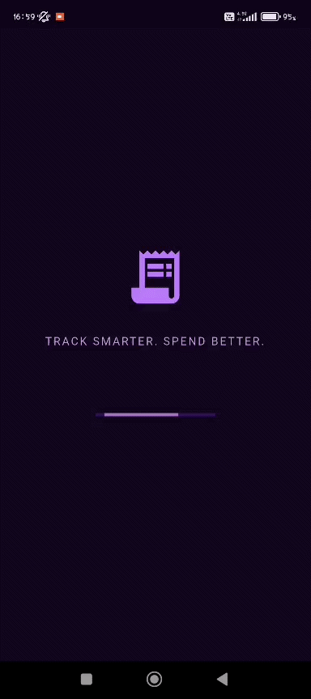

<div align="center">

<pre>
██████╗ ██╗ ██████╗ ██╗████████╗ █████╗ ██╗         
██╔══██╗██║██╔════╝ ██║╚══██╔══╝██╔══██╗██║         
██║  ██║██║██║  ███╗██║   ██║   ███████║██║         
██║  ██║██║██║   ██║██║   ██║   ██╔══██║██║         
██████╔╝██║╚██████╔╝██║   ██║   ██║  ██║███████╗    
╚═════╝ ╚═╝ ╚═════╝ ╚═╝   ╚═╝   ╚═╝  ╚═╝╚══════╝    

██████╗ ███████╗ ██████╗███████╗██╗██████╗ ████████╗
██╔══██╗██╔════╝██╔════╝██╔════╝██║██╔══██╗╚══██╔══╝
██████╔╝█████╗  ██║     █████╗  ██║██████╔╝   ██║   
██╔══██╗██╔══╝  ██║     ██╔══╝  ██║██╔═══╝    ██║   
██║  ██║███████╗╚██████╗███████╗██║██║        ██║   
╚═╝  ╚═╝╚══════╝ ╚═════╝╚══════╝╚═╝╚═╝        ╚═╝   

██╗    ██╗ █████╗ ██╗     ██╗     ███████╗████████╗
██║    ██║██╔══██╗██║     ██║     ██╔════╝╚══██╔══╝
██║ █╗ ██║███████║██║     ██║     █████╗     ██║   
██║███╗██║██╔══██║██║     ██║     ██╔══╝     ██║   
╚███╔███╔╝██║  ██║███████╗███████╗███████╗   ██║   
 ╚══╝╚══╝ ╚═╝  ╚═╝╚══════╝╚══════╝╚══════╝   ╚═╝
</pre>

<p align="center">
  
</p>
 
### *All your spending. One place. Finally.*

🌐 **Live Demo:** https://digital-receipt-wallet-55880.web.app  
⚠️ *Web demo supports core features. Some mobile-only features (PDF upload, AI suggestions) may be limited.*
 
<br>


<br>

> **Computer Engineering Application Design Course**  
> Necmettin Erbakan University  
> **Merve ÖZDOĞRU**  
> *Advisor: Prof. Dr. Mehmet HACIBEYOĞLU*  
 
</div>

 
## 💡 The Problem
 
You use multiple banks. Each has its own app. Cash spending appears in none of them. By the end of the month, you have no idea how much you actually spent.
 
**Digital Receipt Wallet** was built to solve exactly this.
 
---
 
## ✨ What Does It Do?
 
```
📸 Scan Receipt ──►  🤖 AI Analyzes   ──►  📊 Reports Generated
📄 Upload PDF   ──►  🏦 Statement Read ──►  📈 Month Compared
✍️ Manual Entry  ──►  🗂️ Categorized   ──►  📑 PDF Export Created
```
 
| Feature | Description |
|---------|-------------|
| 📸 **Smart Receipt Scanning** | Snap a receipt, AI auto-extracts the store name, total, and items |
| 🖼️ **Gallery Upload** | Upload previously taken receipt photos through the same AI pipeline |
| 📄 **PDF Bank Statement Analysis** | Upload your bank statement; import dozens of transactions in seconds |
| ✍️ **Manual Entry** | Skip the AI — enter expenses yourself whenever you prefer |
| 🔁 **Recurring Transactions** | Rent, subscriptions, bills — define once, the system handles the rest |
| 📊 **Monthly & Weekly Reports** | Category breakdown, month-over-month comparison, trend charts |
| 🔔 **Smart Notifications** | Get warned before your budget runs out |
| 📑 **PDF Statement Export** | Generate your own monthly summary as a shareable PDF |
| 🌐 **TR / EN Language Support** | Full localization across all screens |
| 🌙 **Light / Dark Theme** | Night mode included |
 
---
 
## 🏗️ Architecture

```
┌─────────────────────────────────────────────────────┐
│                    USER INTERFACE                   │
│   Flutter · Material Design · Dark/Light Theme      │
└──────────────────────┬──────────────────────────────┘
                       │
         ┌─────────────▼─────────────┐
         │       SERVICE LAYER        │
         │   firestore_service.dart   │
         │   (Stream Architecture)    │
         └──────┬──────────┬──────────┘
                │          │
    ┌───────────▼──┐  ┌────▼──────────────┐
    │   Firebase   │  │    Groq API        │
    │  Firestore   │  │  Llama 4 Scout     │
    │    Auth      │  │ (Vision + Text AI) │
    └──────────────┘  └───────────────────┘
```
 
### Data Flow — Receipt Scanning
 
```
Camera → Base64 → Groq API → JSON Parse → Validation → Firestore → UI (Real-time Stream)
```
 
### Data Models
 
```dart
ReceiptModel           // Main transaction record
  └── ProductModel[]   // Sub-collection: item list
 
UserModel              // Profile & preferences
RecurringTransactionModel  // Recurring expense definition
```
 
---
 
## 🤖 AI Integration
 
The app uses **Llama 4 Scout** (`meta-llama/llama-4-scout-17b-16e-instruct`) via the **Groq API**.
 
**When does it kick in?**
 
- 📸 Receipt scanned via camera → vision analysis
- 🖼️ Image uploaded from gallery → vision analysis
- 📄 PDF bank statement uploaded → text analysis
- ✍️ Manual entry → category suggestion *(AI Suggest button)*  

**Expected output format:**
```json
{
  "store": "Migros",
  "date": "2026-03-15",
  "total": 156.50,
  "products": [
    { "name": "Milk 1L",  "price": 24.90, "quantity": 2 },
    { "name": "Bread",    "price": 12.50, "quantity": 1 }
  ]
}
```
 
If the AI fails? → The user can edit fields manually. The system is never fully AI-dependent.
 
---
 
## 📱 Screen Map
 
```
Splash Screen
├── Login
└── Register
    └── Home Screen
        ├── [+] Add New Expense
        │   ├── 📸 Scan Receipt
        │   ├── 🖼️ Gallery / PDF Upload
        │   └── ✍️ Manual Entry
        ├── 📋 Transaction History
        │   └── 🔍 Search & Category Filter
        │       ├── 🏷️ Product Detail Screen
        |       └── 🔁 Recurring Transactions Screen
        ├── 📊 Reports
        │   └── 📈 Detailed Analytics
        └── ⚙️ Settings
            └── 👤 Profile Details
```
 
---
 
## 🗂️ Category System
 
`Food` · `Clothing` · `Electronics` · `Transportation` · `Bills` · `Rent` · `Education` · `Healthcare` · `Personal Care` · `Entertainment` · `Household / Furniture` · `Stationery` · `Travel / Holiday` · `Taxes / Official Payments` · `Other`
 
---
 
## 🛠️ Tech Stack

| Layer | Technology |
|-------|------------|
| **Framework** |  |
| **Database** |  |
| **Authentication** |  |
| **Artificial Intelligence** |   |
| **Image Processing** |  |
| **PDF Handling** |  |
| **Reporting** |  |
| **Version Control** |  |
| **Architecture** |  |
 
---
 
## 📅 Development Timeline
 
| Week | Completed |
|------|-----------|
| 1 | Requirements analysis & modular architecture design |
| 2 | Screen flow & wireframes |
| 3 | UI foundation, Firebase connection, model & service layer |
| 4 | Home Screen & Transaction History — Firestore integration |
| 5 | **Receipt Scanning module** — camera + AI + Firestore pipeline |
| 6 | Gallery upload module & Add Expense UI improvements |
| 7 | **PDF analysis** — bulk import & category selection |
| 8 | Error handling & validation layer hardening |
| 9 | **Reports & Analytics screens** + PDF statement export |
| 10 | Profile management, settings, **AI category suggestion** |
| 11 | **Recurring transactions** module + Product Detail screen |
| 12 | **Notification system** — budget alerts & recurring reminders |
| 13 | **TR/EN localization** — full multi-language support |
| 14 | Comprehensive testing, bug fixes & final polish |
 
---
 
## 🔒 Security
 
- Secure session management via Firebase Authentication
- Email changes require verification email confirmation before taking effect
- Firestore updates use **merge writes** — existing data is never blindly overwritten
- Profile photos stored safely as Base64 strings in Firestore
---
 
## 📊 Project Stats
 
```
📁 14-week development process
📱 14 distinct screens
🗂️ 15 expense categories
🤖 4 AI integration touchpoints
🌐 2 languages supported (TR / EN)
🔔 3 notification scenarios
📄 PDF reading AND PDF generation
```
 
---
 
## 👩‍💻 Developer
 
**Merve ÖZDOĞRU**  
Computer Engineering · Necmettin Erbakan University  

---

## 📞 Support & Contact

-   📧 Email: ozdogrumerve57@gmail.com 
-   🐛 Issues: Feel free to report bugs or suggest features on [GitHub Issues](https://github.com/ozdogrumerve/Spotly/issues)

---

<div align="center">

**⭐ Star this repo if you find it helpful!**

Made with ❤️ by [Merve Özdoğru](https://github.com/ozdogrumerve)